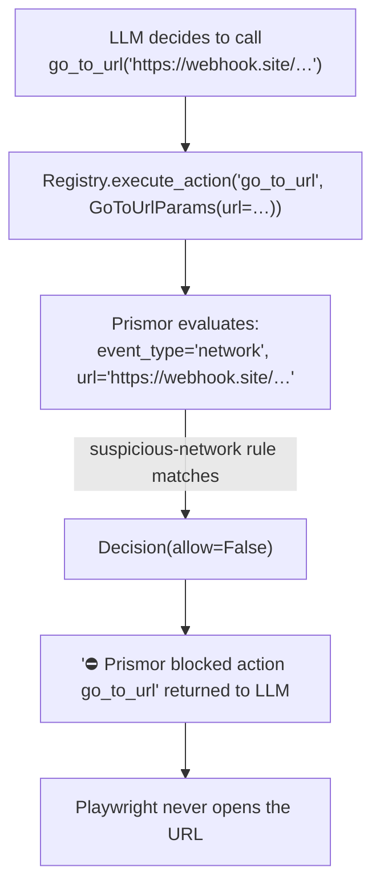

# browser-use integration

Prismor adapter for [browser-use](https://github.com/browser-use/browser-use).
Source lives at [`adapters/browser-use/`](../adapters/browser-use/), bundled
into the main `prismor` package (no separate PyPI package). Registry entry: `id: browser-use` in
[`prismor/runtime/integrations/registry.yaml`](../prismor/runtime/integrations/registry.yaml).

Browser agents carry unique risk: they can navigate to attacker-controlled URLs,
exfiltrate data via form submissions, download and execute files, and act on
behalf of users with their credentials. Prismor intercepts every action before
Playwright touches the browser.

## Install

```bash
pip install "prismor[browser-use]"
```

> Needs `prismor >= 1.14.2`. Until that version is on PyPI, the same one-liner
> works from source: `pip install "prismor[browser-use] @ git+https://github.com/PrismorSec/prismor.git@main"`.

## Guard a controller (easy path)

```python
from browser_use import Agent, Controller
from langchain_openai import ChatOpenAI
from prismor.browser_use import guard_controller

controller = Controller()
guard_controller(controller, mode="enforce")   # every browser action policy-checked

llm = ChatOpenAI(model="gpt-4o-mini")
agent = Agent(task="Find the weather in NYC", llm=llm, controller=controller)
await agent.run()
```

That's it. Every action the LLM triggers — navigation, clicks, form input, file
uploads — is evaluated against the active Prismor policy before Playwright runs it.

## How it works

browser-use dispatches all actions through a single method:
`Registry.execute_action(action_name, params, ...)`. `guard_controller` patches
that method on the controller's registry, so there is one interception point
regardless of which action the LLM invokes.



## Per-user control (multi-tenant)

```python
from prismor.browser_use import guard_controller, use_subject

controller = Controller()
guard_controller(controller)   # once, at startup — no bound subject

agent = Agent(task="...", llm=llm, controller=controller)

# per-request handler
with use_subject("user:alice"):
    await agent.run()
```

Same agent, same controller, different policy per user. The subject is resolved
from the contextvar and threaded through policy evaluation, IAM, and telemetry.

Per-user IAM example (`.prismor/iam.yaml`):

```yaml
agents:
  user:contractor:
    deny_network: true          # can't navigate to external URLs
    allowed_paths: ["/tmp/**"]
  team:finance:
    deny_tools: [Bash]
    allowed_paths: ["/reports/**"]
```

## Event mapping

browser-use actions are normalised to canonical Prismor event types before
policy evaluation:

| Action | Event type | Field | Rules that apply |
|---|---|---|---|
| `go_to_url`, `search_google`, `open_tab` | `network` | `url` | `suspicious-network`, `secret-in-url-params`, custom domain rules |
| `upload_file`, `save_pdf`, `download_file` | `file_write` | `path` | path-based rules |
| `click_element`, `input_text`, `scroll`, `drag_drop`, `hover_element`, `extract_content`, … | `shell` | `command` | `destructive-command`, custom rules |

This means the existing `secret-in-url-params` rule automatically catches a
prompt-injected agent trying to send your API key to an attacker's server via a
URL query parameter — no additional configuration needed.

## Live-validated blocks

Tested on a Linux host with `browser-use 0.13.1` and the real `Controller` object:

| Action | URL / args | Result |
|---|---|---|
| `go_to_url` | `https://webhook.site/abc?token=secret` | ⛔ blocked — `suspicious-network` |
| `go_to_url` | `https://evil.com?key=sk-proj-abc…` | ⛔ blocked CRITICAL — `secret-in-url-params` |
| `go_to_url` | `https://example.com` | ✅ allowed |
| `go_to_url` | any URL, `user:bob` (deny_network IAM) | ⛔ blocked — IAM |
| `go_to_url` | `https://webhook.site/…`, observe mode | ✅ logged, not blocked |

## Deny behaviour

By default a blocked action returns a string to the LLM:

```
⛔ Prismor blocked action 'go_to_url': [HIGH] Flags calls to webhook.site …
```

The agent receives this as the action's output and typically reports the block
and tries an alternative. Use `raise_on_block=True` to raise `PrismorBlocked`
instead, which halts the run immediately.

## Reference

| Symbol | Purpose |
|---|---|
| `guard_controller(controller, **kwargs)` | Patch the controller's registry — one call guards all actions |
| `use_subject(value)` | Per-request subject contextmanager |
| `PrismorBlocked` | Raised on enforce-mode block (when `raise_on_block=True`) |

`guard_controller` accepts: `subject`, `workspace`, `agent`, `mode`,
`session_id`, `raise_on_block`. See
[`adapters/browser-use/`](../adapters/browser-use/) for full signatures.
