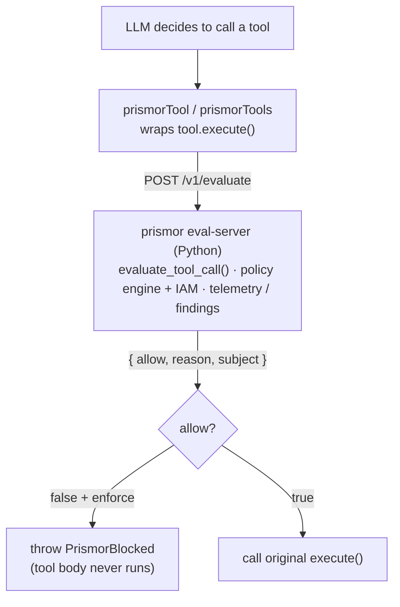

# Vercel AI SDK — Prismor adapter

The Vercel AI SDK adapter (`prismor`) is a TypeScript package that
intercepts every tool `execute()` call before it runs. It is the reference
implementation of the **HTTP adapter pattern**: a thin language-native client
calls the Prismor **eval-server** (a sidecar Python process) to evaluate each
tool call against policy, returning a JSON decision in milliseconds.

## How it works



The Python runtime stays canonical. The TypeScript adapter is ~80 lines of
HTTP client code with no Prismor Python dependency.

## Prerequisites

Start the eval-server once alongside your app (Python, from the `prismor`
repo or any machine with `prismor` installed):

```bash
prismor eval-server --port 7071 --workspace /path/to/project
# or directly:
python3 -m prismor.runtime.eval_server --port 7071 --workspace .
```

The server exposes:
- `POST /v1/evaluate` — accepts a tool-call JSON body, returns a Decision
- `GET  /health`       — liveness probe

## Install

```bash
npm install prismor-warden
```

## Quick start

```typescript
import { generateText, tool } from "ai";
import { openai } from "@ai-sdk/openai";
import { z } from "zod";
import { prismorTools } from "prismor-warden";

const run_shell = tool({
  description: "Execute a shell command",
  parameters: z.object({ command: z.string() }),
  execute: async ({ command }) => { /* your implementation */ },
});

const fetch_url = tool({
  description: "Fetch a URL",
  parameters: z.object({ url: z.string() }),
  execute: async ({ url }) => { /* your implementation */ },
});

// Wrap all tools once, at module scope — every execute() is now policy-checked
const tools = prismorTools({ run_shell, fetch_url });

const result = await generateText({ model: openai("gpt-4o-mini"), tools, prompt });
```

## Blocking dangerous calls

A denied call in enforce mode throws `PrismorBlocked`:

```typescript
import { PrismorBlocked, prismorTools, useSubject } from "prismor-warden";

const tools = prismorTools(myTools); // once, at module scope

// In a Next.js API route:
export async function POST(req: Request) {
  const { prompt } = await req.json();
  const session = await getSession(req);

  try {
    const result = await useSubject(`user:${session.userId}`, () =>
      generateText({ model, tools, prompt }));
    return Response.json({ text: result.text });
  } catch (e) {
    if (e instanceof PrismorBlocked) {
      return Response.json({ error: e.message }, { status: 403 });
    }
    throw e;
  }
}
```

## Per-user (multi-tenant)

Wrap each request handler in `useSubject()` — the TypeScript equivalent of the
Python adapters' `use_subject()`. Every guarded tool call inside the wrapped
scope is attributed to that user, forwarded to the eval-server, resolved to
per-user IAM policies, and recorded in telemetry:

```typescript
const tools = prismorTools(myTools); // guard once — no per-request rebuilding

export async function POST(req: Request) {
  const session = await getSession(req);
  return useSubject(`user:${session.userId}`, () => handleAgentTurn(tools, req));
}
```

The subject rides on `AsyncLocalStorage`, so concurrent requests with different
users cannot bleed into each other. Resolution per call, highest priority
first: the `subject` option on `prismorTools()`, the ambient `useSubject()`
context, then the `PRISMOR_SUBJECT` environment variable — the same order as
the Python runtime's `resolve_subject()`.

Subjects are `"user:<id>"` or the structured form `"user=alice;team=data"`.
Users without an explicit IAM profile fall through to org-wide defaults.

## Options

| Option | Type | Default | Description |
|---|---|---|---|
| `evalUrl` | `string` | `http://127.0.0.1:7071` | Eval-server URL |
| `subject` | `string` | `""` | End-user identity: `"user:alice"` (overrides `useSubject()`) |
| `mode` | `"enforce"\|"observe"` | `"enforce"` | Enforce blocks; observe logs only |
| `failMode` | `"open"\|"closed"` | `"closed"` in enforce, `"open"` in observe | Behavior when the eval-server is unavailable |
| `timeoutMs` | `number` | `10000` | Max wait for the eval-server per call |
| `workspace` | `string` | `process.cwd()` | Project path for policy + IAM lookup |
| `agent` | `string` | `"vercel-ai"` | Agent label in telemetry |
| `agentName` | `string` | same as `agent` | Per-instance name for kill-switch / per-agent controls |
| `eventType` | `string` | `"shell"` | `shell`, `network`, `file_write`, `file_read` |

## Event type mapping

The `eventType` option tells the policy engine which rule class to apply:

| Tool purpose | eventType to use |
|---|---|
| Shell/code execution | `"shell"` (default) |
| HTTP fetch / URL access | `"network"` |
| Writing files | `"file_write"` |
| Reading files | `"file_read"` |

Set it per-tool when wrapping individually:

```typescript
const tools = {
  ...prismorTool("run_shell", run_shell, { eventType: "shell" }),
  ...prismorTool("fetch_url", fetch_url, { eventType: "network" }),
};
```

Or set a default for all tools when using `prismorTools`:

```typescript
const tools = prismorTools(myTools, { eventType: "network" });
```

## Fail mode

If the eval-server cannot answer (down, not yet started, crashed, or slower
than `timeoutMs`), the adapter follows `failMode`:

- **Enforce mode fails closed** (default): the call is blocked with
  `PrismorBlocked`. Enforcement — e.g. a suspended user or a per-user tool
  deny — keeps holding even when the sidecar is down.
- **Observe mode fails open** (default): monitoring never breaks the agent.
- Override either default with `failMode: "open"` or `"closed"`.

```typescript
// Enforce mode, eval-server down:
// console.error("[prismor] eval-server unavailable (fetch failed) — failing closed")
// → throw PrismorBlocked; tool.execute() never runs

// Observe mode (or failMode: "open"), eval-server down:
// console.warn("[prismor] eval-server unavailable (fetch failed) — failing open")
// → tool.execute() is called normally
```

Run `prismor eval-server` as a long-lived sidecar process or a Docker container
to minimise downtime.

> **Changed in 0.3.0:** enforce mode previously failed open. Pass
> `failMode: "open"` to restore the old behavior.

## Modes

```typescript
// Observe: log findings, never block (safe rollout)
const tools = prismorTools(myTools, { mode: "observe" });

// Enforce: block denied calls before execution (default)
const tools = prismorTools(myTools, { mode: "enforce" });
```

Start in `observe` to understand your agent's blast radius without disrupting
users. Switch to `enforce` once confident. Policy is YAML — change it without
redeploying TypeScript code.

## LangChain JS / LangGraph JS

`prismor-warden` also guards LangChain JS tools in place — and therefore
LangGraph agents, whose `ToolNode` / `createReactAgent` execute those tools:

```typescript
import { prismorLangChainTools, useSubject } from "prismor-warden";

const tools = prismorLangChainTools([run_shell, fetch_url]);
const agent = createReactAgent({ llm, tools });
await useSubject(`user:${userId}`, () => agent.invoke({ messages }));
```

`prismorLangChainTool(s)` wraps the tool's `invoke()` (handling both raw args
and LangGraph's ToolCall-shaped input) and returns the same object, so
existing references stay guarded. Denied calls throw `PrismorBlocked`;
LangGraph's `ToolNode` feeds the error back to the model as a `ToolMessage`
by default, so runs recover gracefully. All options in the table above apply.

## Other languages

The eval-server speaks plain JSON over HTTP, so any language can act as an
adapter. Validated on a Linux host with real OpenAI function calls:

| Language | HTTP client | Lines of adapter code |
|---|---|---|
| **Node.js** | `openai` npm + `fetch` | ~25 |
| **Ruby** | stdlib `Net::HTTP` | ~20 |
| **Java 21** | `java.net.http.HttpClient` | ~25 |
| **Rust** | `ureq` (sync) | ~25 |

See `examples/multilang/` for the full runnable examples for each language.

## Eval-server API reference

### `POST /v1/evaluate`

**Request body:**
```json
{
  "tool_name": "run_shell",
  "arguments": { "command": "rm -rf /" },
  "event_type": "shell",
  "agent": "vercel-ai",
  "mode": "enforce",
  "session_id": "optional-session-id",
  "subject": "user:alice",
  "workspace": "/path/to/project"
}
```

Subject can also be passed via `X-Prismor-Subject` header (takes precedence over body field).

**Response:**
```json
{
  "allow": false,
  "reason": "[CRITICAL] Blocks rm -rf /, mkfs, dd to disk, shutdown, reboot",
  "findings": [...],
  "blocking": { ... },
  "subject": { "user_id": "alice", "team_id": null }
}
```

`allow: true` → proceed; `allow: false` + enforce mode → block and surface `reason` to the user.

### `GET /health`

```json
{ "status": "ok", "ts": "2026-06-28T23:15:11.209223+00:00" }
```

## See also

- [Framework adapters overview](frameworks-overview.md) — comparison table, hook points, IAM quick-start
- [CLI reference — eval-server](cli-reference.md#eval-server)
- [IAM](iam.md) — per-user permission profiles
- [Prismor policy engine](prismor-runtime.md) — policy YAML, rule schema, observe vs enforce
